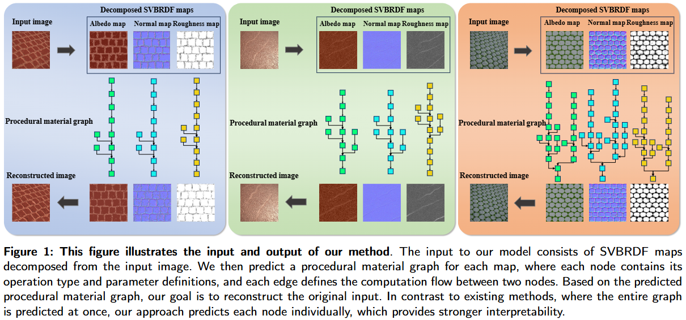

# Interpretable Procedural Material Graph Generation via Diffusion Models from Reference Images

This is the official implementation of the paper Interpretable Procedural Material Graph Generation via Diffusion Models from Reference Images




## Requirements

```
git clone https://github.com/1278323067/procedural_texture.git
cd procedural_texture

conda env create -f timm_texture.yaml
conda activate timm_texture
```

## Dataset

The dataset is available [here](https://pan.baidu.com/s/1G-M5hrVBHZ8QIaoTQV5QEA?pwd=87ix) , which includes images and JSON files (containing the parameter attributes of procedural nodes corresponding to the images).


## Usage

#### checkpoint

The adpater checkpoint file is available [here](https://pan.baidu.com/s/13H1zbZXU7DpmkDDpKND0pg?pwd=aq6h) . After downloading, place it in the \ckpt folder.

The Vit classifier ckeckpoint file is available [here](https://pan.baidu.com/s/12C3FNgdil5kfjsFaGxoXtg?pwd=swth)

#### inference

The inference file is in  experiment/sampler.py

Note that:

- --adapter_path:  The adpater checkpoint file path '.ckpt/img_emb_model'.
- --cls_model_pretrained: The Vit classifier ckeckpoint file path.
- --node_type_path: node_type.pkl
- --image_input: image file path

```
cd experiment
python sampler.py
```

After running this , the results are in experiment/output/

You will get results like this 

2.

run ./diffmat_1/test/test_hybrid_optimizer.py to get  the optimization parameters, more details see [diffmat](https://github.com/mit-gfx/diffmat/tree/master).

These generated nodes and parameters can later be used in Substance Designer 
